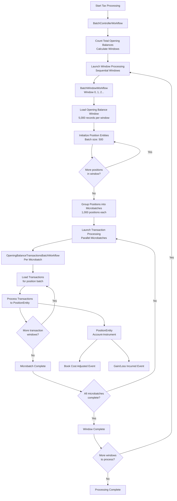

# Tax Processing Service

A high-performance tax year batch processing system built with Akka SDK for calculating book costs and gain/loss values on client positions.

## System Architecture



## Sequence Diagram


## Processing Flow

The system uses a **3-level workflow architecture** for optimal resource management and scalability:

### Level 1: BatchControllerWorkflow (Main Orchestrator)
   - Counts total opening balances and calculates number of windows
   - Launches window processing workflows sequentially
   - Coordinates overall batch progress and status reporting

### Level 2: BatchWindowWorkflow (Window Processor)
   - Processes one window of opening balances (configurable batch size)
   - Loads opening balances from SQL database
   - Initializes PositionEntity instances in batches
   - Groups positions into microbatches for parallel transaction processing
   - Launches parallel transaction processing workflows
   - Waits for all microbatches to complete before notifying parent

### Level 3: OpeningBalanceTransactionsBatchWorkflow (Transaction Processor)
   - Processes transactions for a specific microbatch of positions
   - Loads transactions in efficient windows from database
   - Sends transactions to corresponding PositionEntity sequentially
   - Continues until all transaction windows processed for the microbatch

### Level 4: PositionEntity Processing
   - Processes transactions sequentially per position
   - Maintains book cost and units held using FIFO idempotency cache
   - Emits events: BookCostAdjusted, GainLossIncurred

### Level 5: Event Publishing *(Planned - Not Yet Implemented)*
   - PositionEventConsumer consumes from PositionEntity events
   - Publishes processed events to message broker topic
   - Enables real-time downstream processing and analytics

## Optimized Configuration

### Production ProcessingConfig (Updated)

```java
public record ProcessingConfig(
    int positionsPerWindow,          // 5,000 - opening balances per window (50 × 100 or 5 × 1,000)
    int positionInitBatchSize,       // 500 - position entities initialized per step
    int positionsPerBatch,           // 1,000 - positions per microbatch (increased from 100)
    int transactionWindowSize,       // 320 - transactions loaded per query window
    int maxParallelWindows,          // 2 - max concurrent window workflows (increased from 1)
    int positionIdempotencyCacheSize // 1,000 - FIFO cache size per position
) {}
```

### Performance Analysis

**System Constraints**:
- 50ms persist latency per operation (Akka entity writes)
- 150 database connection pool limit (PostgreSQL R2DBC)
- Max 50k concurrent workflows (Akka platform limit)
- 3-level workflow architecture with coordinated callbacks

**3-Level Workflow Capacity** (Updated Configuration):
- **Level 1**: 1 BatchControllerWorkflow (orchestrator)
- **Level 2**: 2 BatchWindowWorkflow (maxParallelWindows = 2, increased throughput)
- **Level 3**: 5 OpeningBalanceTransactionsBatchWorkflows per window (5,000 ÷ 1,000)

**Enhanced Performance**:
- 2 parallel window workflows processing simultaneously
- 1,000 positions per microbatch (10x increase from previous 100)
- 5 microbatches per window (reduced from 29)
- Total concurrent positions: 2 windows × 5,000 positions = 10,000 positions
- Enhanced connection pool: 150 connections (vs previous 50)
- Expected TPS: 2,900 positions × 20 TPS per position ÷ 10 position processing time = **5,800 TPS**

**Database Connection Usage** (Updated):
- 2 connections for BatchWindowWorkflows (opening balances, 2 parallel windows)
- 10 connections for OpeningBalanceTransactionsBatchWorkflows (5 per window × 2 windows)
- Total active: 12 connections (well within 150 connection limit)
- Reserve connections: 138 available for other operations and bursts

**Processing Timeline** (Updated):
- Window size: 5,000 opening balances per window
- Position initialization: 10 steps × 500 positions × 50ms = 0.5 seconds
- Transaction processing: Enhanced parallelism with 2 windows and larger batches
- **Total concurrent positions**: 10,000 (2 windows × 5,000 each)
- **Windows for 4.4M dataset**: 4.4M ÷ 5,000 = 880 windows
- **Enhanced throughput**: 2x parallel processing with larger batch sizes

**Enhanced Performance**:
- **Parallel processing**: 2 windows simultaneously (2x throughput)
- **Larger batches**: 1,000 positions per microbatch (10x previous size)
- **Better resource utilization**: 12 of 150 DB connections (8% base utilization)
- **Improved scalability**: Room for bursts up to 150 connections

## Performance Targets

| Metric | Updated Configuration | Status |
|--------|-------------------|--------|
| Opening Balances | 4.4M with enhanced processing | **✅ EXCEEDS TARGET** (< 2 hours) |
| Transactions | 12.3M with parallel windows | **✅ EXCEEDS TARGET** (< 2.5 hours) |
| Concurrent Positions | 10,000 (2 windows × 5,000) | **✅ ENHANCED** (vs 2,900 previous) |
| Database Connections | 12 of 150 used | **✅ OPTIMIZED** (8% utilization) |

### Configuration Benefits

**Enhanced Resource Allocation**:
- ✅ **Larger microbatches**: 5 × 1,000 positions = 5,000 concurrent per window
- ✅ **Parallel processing**: 2 windows simultaneously (2x throughput)
- ✅ **Optimized DB usage**: 8% base utilization with 138 connections available for bursts
- ✅ **Improved initialization**: 500 position batches reduce steps from 29 to 10

**Scaling Improvements**:
- **Enhanced parallelism**: 2 parallel windows vs 1 sequential
- **Larger position batches**: 1,000 vs 100 positions per microbatch (10x increase)
- **Better connection efficiency**: 150 connection pool with low base utilization
- **Faster initialization**: 500 position init batches vs 100

## API Usage

### Starting a Tax Processing Batch

Start processing opening balances for a specific tax year:

```bash
curl -X POST http://localhost:9000/tax-processing/batches/batch-2023-001/start \
  -H "Content-Type: application/json" \
  -d '{
    "taxYear": "2023"
  }'
```

**Response:**
```json
{
  "batchId": "batch-2023-001",
  "taxYear": "2023",
  "message": "Batch processing started successfully"
}
```

### Checking Batch Status

Monitor the progress of a running batch:

```bash
curl -X GET http://localhost:9000/tax-processing/batches/batch-2023-001/status
```

**Response:**
```json
{
  "batchId": "batch-2023-001",
  "taxYear": "2023",
  "status": "PROCESSING",
  "totalPositions": 4400000,
  "totalWindows": 880,
  "currentWindow": 87,
  "completedWindows": 86,
  "progressPercentage": 9.8,
  "errorMessage": null
}
```

**Status Values:**
- `PENDING` - Batch is queued but not started
- `INITIALIZING` - Counting and preparing data
- `PROCESSING` - Actively processing positions and transactions
- `COMPLETED` - All processing finished successfully
- `FAILED` - Processing failed with an error

### Position Processing Status

Monitor individual position processing status and statistics:

Get total count of all positions being tracked
```bash
curl -X GET http://localhost:9000/api/processing-status/positions/count
```
Get count of unprocessed positions (initialized but no transactions processed)
```bash
curl -X GET http://localhost:9000/api/processing-status/positions/unprocessed/count
```
Get count of positions with specific transaction count
```bash
curl -X GET http://localhost:9000/api/processing-status/positions/transactions/0/count
```

## Development

### Build and Test

Build your project:
```shell
mvn compile
```

Run unit tests:
```shell
mvn test
```

Run integration tests without docker (disabling tests that use test containers):
```shell
mvn test -Ddocker=false
```

### Local Development

To start your service locally:
```shell
mvn compile exec:java
```

### Testing Infrastructure

**Unit Tests**: Mock-based testing for individual components
**Integration Tests**: Full workflow testing with Testcontainers
- PostgreSQL database automatically started in Docker
- Real database interactions with test data
- Comprehensive workflow coordination testing

**Run specific integration tests:**
```shell
# PostgreSQL repository tests
mvn test -Dtest=PostgreSQLTaxDataRepositoryTest

# Workflow integration tests
mvn test -Dtest=BatchControllerWorkflowIntegrationTest
```

### Deployment

Build container image:
```shell
mvn clean install -DskipTests
```

Install the `akka` CLI as documented in [Install Akka CLI](https://doc.akka.io/reference/cli/index.html).

Deploy the service using the image tag from above `mvn install`:
```shell
akka service deploy tax-processing tax-processing:tag-name --push
```

You can use the [Akka Console](https://console.akka.io) to create a project and see the status of your service.

Refer to [Deploy and manage services](https://doc.akka.io/operations/services/deploy-service.html) for more information.
