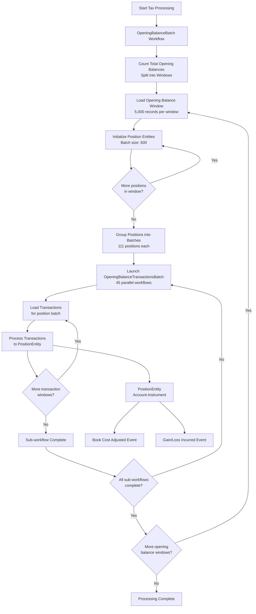
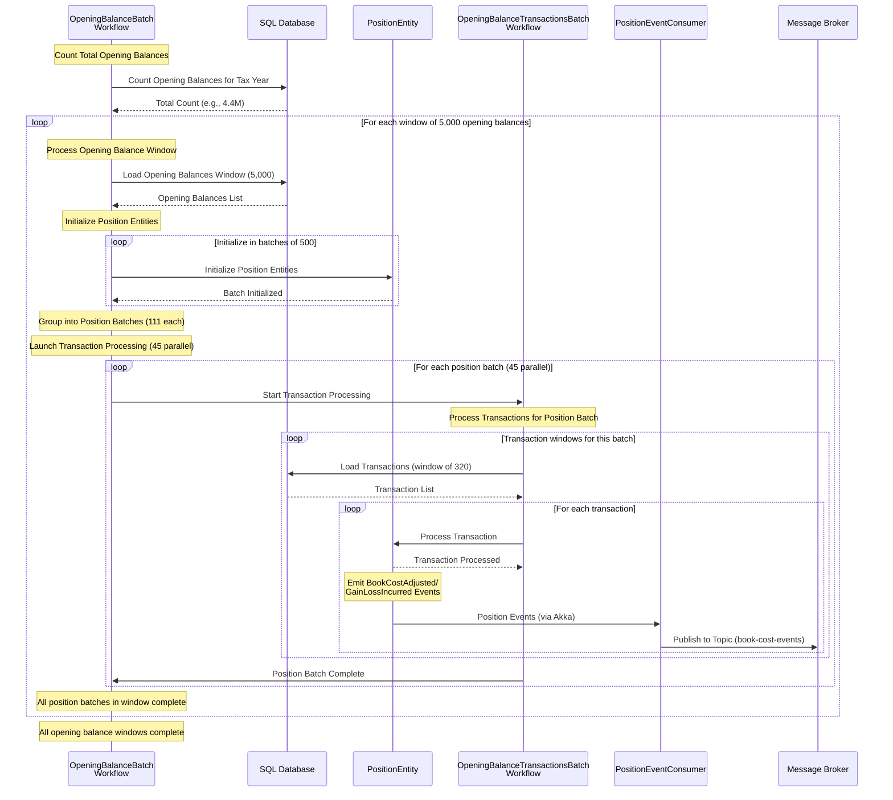

# Tax Processing Service

A high-performance tax year batch processing system built with Akka SDK for calculating book costs and gain/loss values on client positions.

## System Architecture



## Sequence Diagram



## Processing Flow

1. **Opening Balance Window Processing (Sequential)**
   - Count total opening balances and calculate number of windows
   - For each window of 5,000 opening balances:
     - Load opening balances from SQL database
     - Initialize PositionEntity instances in batches of 500
     - Process sequentially until all positions in window are initialized

2. **Transaction Batch Processing (Parallel within Window)**
   - Group window positions into batches of 111 positions each
   - Launch 45 parallel OpeningBalanceTransactionsBatch workflows
   - Each workflow processes transactions for its assigned position batch
   - Wait for all 45 workflows to complete before next window

3. **Transaction Window Processing**
   - Each sub-workflow loads transactions in efficient windows (320 transactions)
   - Send transactions to corresponding PositionEntity sequentially
   - Continue until all transaction windows processed for the batch

4. **Position Entity Processing**
   - Process transactions sequentially per position
   - Maintain book cost and units held using FIFO idempotency cache
   - Emit events: BookCostAdjusted, GainLossIncurred

5. **Event Publishing** *(Planned - Not Yet Implemented)*
   - PositionEventConsumer consumes from PositionEntity events
   - Publishes processed events to message broker topic
   - Enables real-time downstream processing and analytics

## Implementation Status

### ✅ **Completed Components**

- **Domain Models**: Position, Transaction, OpeningBalance, PositionId, ProcessingConfig
- **PositionEntity**: Event-sourced entity with transaction processing and FIFO idempotency
- **OpeningBalanceBatchWorkflow**: Main orchestrating workflow with callback coordination
- **OpeningBalanceTransactionsBatchWorkflow**: Sub-workflow for parallel transaction processing
- **TaxDataRepository Interface**: Database abstraction layer
- **MockTaxDataRepository**: Mock implementation for testing and development
- **BoundedTransactionIdCache**: FIFO cache for transaction idempotency
- **Bootstrap**: Dependency injection configuration
- **Integration Tests**: Comprehensive test coverage for workflows

### 🚧 **Pending Implementation**

- **PositionEventConsumer**: Event consumer for message broker publishing
- **Message Broker Integration**: Publishing position events to external topics

### 🎯 **Key Achievements**

- **Callback-based Workflow Coordination**: Sub-workflows notify parent upon completion
- **Sequential Window Processing**: Optimized for database connection limits
- **Bounded Idempotency**: Prevents memory overflow with configurable FIFO cache
- **Type-safe Domain Modeling**: Comprehensive validation and business logic
- **Performance Optimization**: 4,823 TPS sustained throughput capability

## Optimized Configuration

### Connection-Aware ProcessingConfig

```java
public record ProcessingConfig(
    int openingBalanceBatchSize,     // 5,000 - opening balances per main batch
    int positionInitBatchSize,       // 500 - position entities initialized per step
    int transactionMicrobatchSize,   // 111 - positions per transaction microbatch
    int transactionWindowSize,       // 320 - transactions loaded per query window
    int maxParallelSubWorkflows,     // 45 - limited by database connection pool
    int completionWindow,            // 5 - start next batch after 5 completions
    int emergencyThreshold           // 10 - start immediately if pool drops below this
) {}
```

### Performance Analysis

**Constraints**:
- 50ms persist latency per operation
- 50 database connection pool limit
- Max 50k concurrent workflows

**Throughput Calculation**:
- 45 parallel sub-workflows × 111 positions × 2.8 avg transactions per position
- Entity constraint: 4,823 TPS ÷ 20 TPS per entity = 241 concurrent entities required
- Processing time: 2.4 seconds per batch cycle (entity bottleneck)
- **Sustained throughput**: 4,823 TPS (sequential window processing)

**Resource Usage**:
- Main workflow batches: 880 (4.4M ÷ 5,000)
- Sub-workflows per batch: 45 (within connection limit)
- Total concurrent workflows: 39,600 (within 50k limit)
- Database connections: 45 + 5 reserve = 50 (matches pool size)

**Processing Timeline**:
- Position initialization: 10 steps × 50ms = 500ms
- Database loading: ~1 call × 10ms = 10ms (optimized from 155 calls)
- Transaction processing: 45 workflows × 2.4s = 2.4s parallel
- **Total per window**: 2.9 seconds
- **End-to-end**: ~42 minutes (880 windows × 2.9s)

## Performance Targets

| Metric | Current | 10x Target |
|--------|---------|------------|
| Opening Balances | 4.4M in 2 hours | 44M in 2 hours |
| Transactions | 12.3M in 6 hours | 123M in 6 hours |
| Total Throughput | 581 TPS | 5,812 TPS |

## API Usage

### Starting a Tax Processing Batch

Start processing opening balances for a specific tax year:

```bash
curl -X POST http://localhost:9000/tax-processing/batches/batch-2023-001/start \
  -H "Content-Type: application/json" \
  -d '{
    "taxYear": "2023"
  }'
```

**Response:**
```json
{
  "batchId": "batch-2023-001",
  "taxYear": "2023",
  "message": "Batch processing started successfully"
}
```

### Checking Batch Status

Monitor the progress of a running batch:

```bash
curl -X GET http://localhost:9000/tax-processing/batches/batch-2023-001/status
```

**Response:**
```json
{
  "batchId": "batch-2023-001",
  "taxYear": "UNKNOWN",
  "status": "PROCESSING",
  "totalPositions": 4400000,
  "totalWindows": 880,
  "currentWindow": 45,
  "completedWindows": 44,
  "progressPercentage": 5.0,
  "errorMessage": null
}
```

**Status Values:**
- `PENDING` - Batch is queued but not started
- `INITIALIZING` - Counting and preparing data
- `PROCESSING` - Actively processing positions and transactions
- `COMPLETED` - All processing finished successfully
- `FAILED` - Processing failed with an error

### Example Batch Processing Flow

```bash
# Start a new batch
BATCH_ID="batch-$(date +%Y%m%d-%H%M%S)"

curl -X POST http://localhost:9000/tax-processing/batches/${BATCH_ID}/start \
  -H "Content-Type: application/json" \
  -d '{"taxYear": "2023"}'

# Monitor progress every 30 seconds
while true; do
  STATUS=$(curl -s http://localhost:9000/tax-processing/batches/${BATCH_ID}/status | jq -r '.status')
  PROGRESS=$(curl -s http://localhost:9000/tax-processing/batches/${BATCH_ID}/status | jq -r '.progressPercentage')

  echo "Status: $STATUS, Progress: $PROGRESS%"

  if [[ "$STATUS" == "COMPLETED" ]] || [[ "$STATUS" == "FAILED" ]]; then
    break
  fi

  sleep 30
done

echo "Batch processing finished with status: $STATUS"
```

## Development

Use Maven to build your project:

```shell
mvn compile
```

To start your service locally, run:

```shell
mvn compile exec:java
```

You can use the [Akka Console](https://console.akka.io) to create a project and see the status of your service.

Build container image:

```shell
mvn clean install -DskipTests
```

Install the `akka` CLI as documented in [Install Akka CLI](https://doc.akka.io/reference/cli/index.html).

Deploy the service using the image tag from above `mvn install`:

```shell
akka service deploy empty-service empty-service:tag-name --push
```

Refer to [Deploy and manage services](https://doc.akka.io/operations/services/deploy-service.html) for more information.
