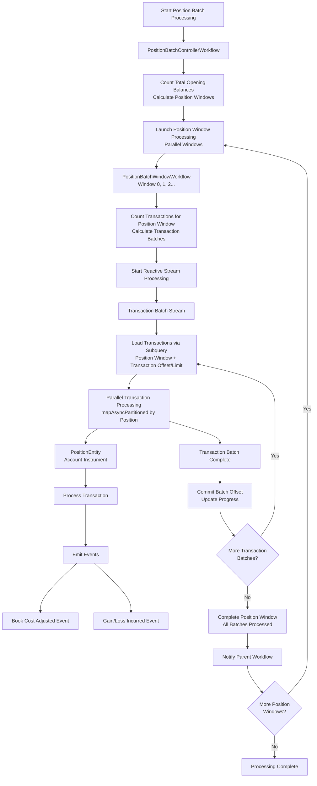
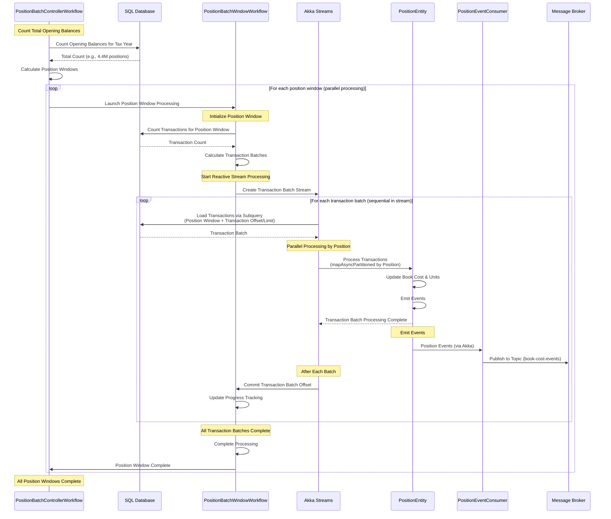

# Tax Processing Service

A high-performance tax year batch processing system built with Akka SDK for calculating book costs and gain/loss values on client positions.

## System Architecture



## Sequence Diagram



## Processing Flow

The system uses a **2-level workflow architecture with Akka Streams** for optimal resource management and scalability:

### Level 1: PositionBatchControllerWorkflow (Main Orchestrator)
   - Counts total opening balances for the tax year
   - Calculates number of position windows based on `position-number-per-window` configuration
   - Launches position window workflows in parallel (controlled by `position-max-parallel-windows`)
   - Coordinates overall batch progress and status reporting
   - Uses callback-based coordination for window completion

### Level 2: PositionBatchWindowWorkflow (Reactive Stream Processor)
   - Processes transactions for a specific position window using Akka Streams
   - Counts transactions for the position window to calculate transaction batches
   - Creates a reactive stream that processes transaction batches sequentially
   - Uses `loadTransactionsForPositionWindow` with subquery-based position selection
   - Employs `mapAsyncPartitioned` for parallel transaction processing by position
   - Implements offset-based progress tracking and error handling with retries
   - Notifies parent workflow upon completion or failure

### Level 3: PositionEntity Processing
   - Processes transactions sequentially per position to maintain FIFO ordering
   - Maintains book cost and units held using idempotency cache
   - Emits events: BookCostAdjusted, GainLossIncurred
   - Ensures data consistency through event sourcing

### Level 4: Event Publishing *(Planned - Not Yet Implemented)*
   - PositionEventConsumer consumes from PositionEntity events
   - Publishes processed events to message broker topic
   - Enables real-time downstream processing and analytics

## Key Architectural Benefits

**Reactive Streams Processing:**
- **Backpressure Management**: Akka Streams automatically manages memory usage and prevents overloading
- **Parallel Processing**: `mapAsyncPartitioned` ensures parallel processing while maintaining per-position ordering
- **Efficient Database Access**: Subquery-based transaction loading reduces database roundtrips
- **Progress Tracking**: Offset-based tracking allows for resumable processing and monitoring

**Scalable Design:**
- **Configurable Parallelism**: Both position windows and transaction processing are configurable
- **Resource Optimization**: Stream-based processing minimizes memory footprint
- **Error Resilience**: Built-in retry mechanisms with configurable limits
- **Monitoring Integration**: Comprehensive logging and progress tracking

## Configuration

### Current ProcessingConfig

```java
public record ProcessingConfig(
    int positionNumberPerWindow,      // 500 - positions per window (configurable via POSITION_NUMBER_PER_WINDOWS)
    int positionMaxParallelWindows,   // 6 - max concurrent window workflows (configurable via POSITION_MAX_WINDOWS)
    int positionIdempotencyCacheSize, // 10 - FIFO cache size per position (configurable via POSITION_IDEMPOTENCY_CACHE_SIZE)
    int transactionsBatchLimit,       // 200 - transactions per batch in stream (configurable via TRANSACTION_BATCH_LIMIT)
    int transactionsBatchParallelism  // 25 - parallel transactions processed per batch (configurable via TRANSACTION_BATCH_PARALLELISM)
) {}
```

### Environment Variables

All configuration parameters can be overridden using environment variables:

```bash
# Position window configuration
export POSITION_NUMBER_PER_WINDOWS=500    # Positions per window
export POSITION_MAX_WINDOWS=6             # Max parallel windows

# Position entity configuration
export POSITION_IDEMPOTENCY_CACHE_SIZE=10 # Cache size per position

# Transaction processing configuration
export TRANSACTION_BATCH_LIMIT=200        # Transactions per stream batch
export TRANSACTION_BATCH_PARALLELISM=25   # Parallel transaction processing

# Database configuration
export TAX_DB_HOST=localhost
export TAX_DB_PASSWORD=your_password
export TAX_DB_SSL_ENABLED=true
export TAX_DB_MONITORING_DELAY=10
export TAX_DB_POOL_INIT_SIZE=6
export TAX_DB_POOL_MAX_SIZE=10
```

### Performance Analysis

**Current Architecture Performance**:
- **Position Windows**: 500 positions per window, up to 6 parallel windows
- **Transaction Processing**: 200 transactions per batch, 25 parallel processing
- **Total Concurrent Processing**: 6 windows × 500 positions = 3,000 positions simultaneously
- **Akka Streams Benefits**: Automatic backpressure, memory management, fault tolerance

**Database Connection Usage**:
- **Position Window Queries**: 1 connection per active window (max 6)
- **Transaction Stream Processing**: Efficient subquery-based loading
- **Connection Pool**: 10 max connections with 6 initial
- **SSL Support**: Configurable SSL connections for cloud databases

**Scalability Characteristics**:
- **Reactive Streams**: Built-in backpressure prevents memory overload
- **Partitioned Processing**: `mapAsyncPartitioned` maintains per-position ordering
- **Progress Tracking**: Offset-based resumable processing
- **Error Recovery**: Automatic retries with configurable limits

**Resource Optimization**:
- **Memory Efficient**: Stream-based processing with controlled batching
- **Connection Efficient**: Subquery-based loading reduces database roundtrips
- **CPU Efficient**: Configurable parallelism for different deployment environments
- **Monitoring Ready**: Built-in metrics and progress tracking

## Performance Targets

| Metric | Current Configuration | Optimization |
|--------|---------------------|--------------|
| Position Windows | 500 positions/window × 6 parallel | **Configurable** via environment variables |
| Transaction Batches | 200 transactions/batch × 25 parallel | **Tunable** for different workloads |
| Database Connections | 6-10 connections (efficient usage) | **SSL-ready** for cloud deployments |
| Memory Usage | **Stream-controlled** with backpressure | **Predictable** resource consumption |

### Configuration Benefits

**Environment-Based Configuration**:
- ✅ **Flexible Deployment**: All parameters configurable via environment variables
- ✅ **Cloud-Ready**: SSL database connections with environment-based credentials
- ✅ **Scalable Processing**: Adjustable parallelism for different environments
- ✅ **Resource Control**: Tunable batch sizes and connection pools

**Reactive Architecture**:
- ✅ **Backpressure Management**: Automatic memory and resource protection
- ✅ **Fault Tolerance**: Built-in retry mechanisms and error handling
- ✅ **Progress Tracking**: Offset-based resumable processing
- ✅ **Monitoring Integration**: Comprehensive logging and metrics

## API Usage

### Position Batch Processing

#### Starting Position Batch Processing

Start processing positions for a specific tax year:

```bash
curl -X POST http://localhost:9000/tax-processing/position-batches/pos-batch-2023-001/start \
  -H "Content-Type: application/json" \
  -d '{
    "taxYear": "2023"
  }'
```

**Response:**
```json
{
  "batchId": "pos-batch-2023-001",
  "taxYear": "2023",
  "message": "Position batch processing started successfully"
}
```

#### Checking Position Batch Status

Monitor the progress of a running position batch:

```bash
curl -X GET http://localhost:9000/tax-processing/position-batches/pos-batch-2023-001/status
```

**Response:**
```json
{
  "batchId": "pos-batch-2023-001",
  "taxYear": "2023",
  "status": "AWAITING_WINDOW_SUB_WORKFLOWS_CALLBACK",
  "totalPositions": 4400000,
  "totalWindows": 880,
  "runningWindowIds": ["0", "1", "2"],
  "completedWindows": 12,
  "completedPositions": 6000,
  "errorMessage": null
}
```

### Common Status Values

**Processing Status:**
- `PENDING` - Batch is queued but not started
- `INITIALIZING` - Counting and preparing data
- `PROCESSING` - Actively processing positions/transactions
- `COMPLETED` - All processing finished successfully
- `FAILED` - Processing failed with an error

**Window Status:**
- `PENDING` - Window not yet started
- `PROCESSING` - Window currently being processed
- `COMPLETED` - Window processing completed successfully
- `FAILED` - Window processing failed

### Position Processing Status

Monitor individual position processing status and statistics:

Get total count of all positions being tracked
```bash
curl -X GET http://localhost:9000/api/processing-status/positions/count
```
Get count of unprocessed positions (initialized but no transactions processed)
```bash
curl -X GET http://localhost:9000/api/processing-status/positions/unprocessed/count
```
Get count of positions with specific transaction count
```bash
curl -X GET http://localhost:9000/api/processing-status/positions/transactions/6/count
```

#### Triggering Position Batch Window Timeout

Manually trigger a timeout for a specific position batch window (useful for debugging or forcing completion):

```bash
curl -X POST http://localhost:9000/tax-processing/position-batches/pos-batch-2023-001/window/5/running-timeout-trigger
```

This endpoint triggers a timeout for position batch window processing, which can help resolve stuck windows or test timeout handling behavior.

## Development

### Database Setup

This section explains how to set up and populate the PostgreSQL database for testing the tax processing system.

#### Quick Start

1. **Start the database**:
```bash
docker-compose -f docker-compose-postgresql.yml up -d
```

2. **Wait for database to be ready** (check health status):
```bash
docker-compose -f docker-compose-postgresql.yml ps
```

3. **Connect to database**:
```bash
# Interactive psql session (recommended):
docker exec -it tax-processing-postgresql psql -U postgres -d postgres
```

4. **Run schema and data generation**:

Docker-based PostgreSQL:
```bash
docker exec -i tax-processing-postgresql psql -U postgres -d postgres < postgresql/01_create_database.sql
docker exec -i tax-processing-postgresql psql -U postgres -d postgres < postgresql/02_create_schema.sql
docker exec -i tax-processing-postgresql psql -U postgres -d postgres < postgresql/03_generate_test_data.sql
```

Remote PostgreSQL installation:
```bash
psql -h <your-db-host> -p 5432 -U postgres -d postgres -f postgresql/01_create_database.sql
psql -h <your-db-host> -p 5432 -U postgres -d postgres -f postgresql/02_create_schema.sql
psql -h <your-db-host> -p 5432 -U postgres -d postgres -f postgresql/03_generate_test_data.sql
```

#### Database Cleanup

To stop and remove the database:
```bash
docker-compose -f docker-compose-postgresql.yml down -v
```

### Build and Test

Build your project:
```shell
mvn compile
```

Run unit tests:
```shell
mvn test
```

Run integration tests without docker (disabling tests that use test containers):
```shell
mvn test -Ddocker=false
```

### Local Development

To start your service locally:
```shell
mvn compile exec:java
```

### Observability

To run the observability stack with Grafana and Prometheus monitoring:

```shell
docker-compose -f docker-grafana-prometheus-monitoring.yml up
```

This will start:
- **Grafana** - Data visualization and monitoring dashboards (accessible at http://localhost:3000)
- **Prometheus** - Metrics collection and storage
- **Application metrics** - Akka SDK automatically exposes metrics for monitoring

The monitoring stack provides insights into:
- Application performance metrics
- JVM and system resource usage
- Custom business metrics
- Request/response patterns

### Testing Infrastructure

**Unit Tests**: Mock-based testing for individual components
**Integration Tests**: Full workflow testing with Testcontainers
- PostgreSQL database automatically started in Docker
- Real database interactions with test data
- Comprehensive workflow coordination testing

**Run specific integration tests:**
```shell
# PostgreSQL repository tests
mvn test -Dtest=PostgreSQLTaxDataRepositoryTest

# Workflow integration tests
mvn test -Dtest=BatchControllerWorkflowIntegrationTest
```

### Deployment

Build container image:
```shell
mvn clean install -DskipTests
```

Install the `akka` CLI as documented in [Install Akka CLI](https://doc.akka.io/reference/cli/index.html).

#### Creating Secrets

Before deploying, create secrets for configuration values that are referenced in your `service.yaml`:

```shell
# Database configuration secret
akka secret create generic tax-db-secret \
  --literal TAX_DB_HOST=<host> \
  --literal TAX_DB_PASSWORD=<password> \
  --literal TAX_DB_MONITORING_DELAY=0

# Application configuration secret
akka secret create generic app-secret \
  --literal POSITION_NUMBER_PER_WINDOWS=500 \
  --literal POSITION_MAX_WINDOWS=5 \
  --literal POSITION_IDEMPOTENCY_CACHE_SIZE=10 \
  --literal TRANSACTION_BATCH_LIMIT=200 \
  --literal TRANSACTION_BATCH_PARALLELISM=2
```

**List existing secrets:**
```shell
akka secret list
```

#### Push Container Image

Push the container image to the registry:
```shell
docker push tax-processing:latest
```

#### Service Deployment

**Important**: Update the image tag in `service.yaml` to match the pushed image before deployment.

Deploy the service using the service descriptor:
```shell
akka service deploy apply -f service.yaml
```

You can use the [Akka Console](https://console.akka.io) to create a project and see the status of your service.

Refer to [Deploy and manage services](https://doc.akka.io/operations/services/deploy-service.html) for more information.
