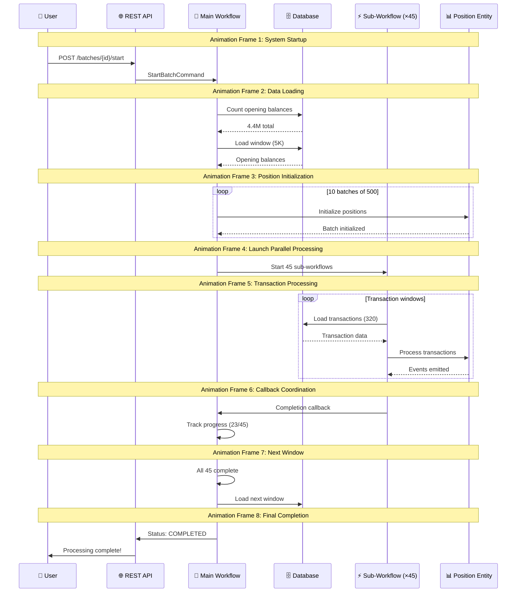

# Tax Processing Workflow Animation Guide

This document provides visual representations that can be used to create animations of the tax processing workflow.

## ASCII Animation Frames

### Frame 1: Initial Setup
```
┌─────────────────────────────────────────────────────────────────┐
│                    TAX PROCESSING SYSTEM                        │
│                                                                 │
│  📊 Input: 4.4M Opening Balances + 12.3M Transactions (2023)   │
│  🎯 Target: 4,823 TPS sustained throughput                     │
│                                                                 │
│  [START] ──────────────────────────────────────────────────────│
└─────────────────────────────────────────────────────────────────┘
```

### Frame 2: Window Processing Begins
```
┌─────────────────────────────────────────────────────────────────┐
│  MAIN WORKFLOW: OpeningBalanceBatchWorkflow                     │
│                                                                 │
│  📋 Total Windows: 880 (4.4M ÷ 5,000)                         │
│  📦 Current Window: 1/880                                       │
│                                                                 │
│  ┌─────────────────┐                                           │
│  │   Loading 5K    │ ◀── Database Query                        │
│  │ Opening Balance │                                           │
│  └─────────────────┘                                           │
│         │                                                       │
│         ▼                                                       │
│  Status: INITIALIZING                                           │
└─────────────────────────────────────────────────────────────────┘
```

### Frame 3: Position Initialization
```
┌─────────────────────────────────────────────────────────────────┐
│  POSITION INITIALIZATION PHASE                                  │
│                                                                 │
│  ┌─────┐ ┌─────┐ ┌─────┐ ┌─────┐ ┌─────┐                      │
│  │Batch│ │Batch│ │Batch│ │Batch│ │Batch│                      │
│  │ 1   │ │ 2   │ │ 3   │ │ 4   │ │ 5   │  ◀── 500 positions   │
│  │500  │ │500  │ │500  │ │500  │ │500  │      each batch      │
│  └─────┘ └─────┘ └─────┘ └─────┘ └─────┘                      │
│     │       │       │       │       │                         │
│     ▼       ▼       ▼       ▼       ▼                         │
│  [PositionEntity] [PositionEntity] [PositionEntity] ...        │
│                                                                 │
│  Status: INITIALIZING → LAUNCHING_SUB_WORKFLOWS                 │
└─────────────────────────────────────────────────────────────────┘
```

### Frame 4: Parallel Transaction Processing
```
┌─────────────────────────────────────────────────────────────────┐
│  PARALLEL TRANSACTION PROCESSING (45 Sub-Workflows)            │
│                                                                 │
│  ┌─────┐ ┌─────┐ ┌─────┐     ┌─────┐ ┌─────┐                  │
│  │Sub-1│ │Sub-2│ │Sub-3│ ... │Sub44│ │Sub45│                  │
│  │ 111 │ │ 111 │ │ 111 │     │ 111 │ │ 111 │ ◀─ positions    │
│  │pos. │ │pos. │ │pos. │     │pos. │ │pos. │   per workflow  │
│  └─────┘ └─────┘ └─────┘     └─────┘ └─────┘                  │
│     ║       ║       ║   ...     ║       ║                     │
│     ▼       ▼       ▼           ▼       ▼                     │
│  ┌────────────────────────────────────────────────────────┐    │
│  │         Transaction Window Loading (320 each)          │    │
│  │  [Txn1][Txn2][Txn3]...[Txn320] → PositionEntity      │    │
│  └────────────────────────────────────────────────────────┘    │
│                                                                 │
│  Status: LAUNCHING_SUB_WORKFLOWS → AWAITING_CALLBACKS          │
└─────────────────────────────────────────────────────────────────┘
```

### Frame 5: Callback Coordination
```
┌─────────────────────────────────────────────────────────────────┐
│  CALLBACK-BASED COORDINATION                                   │
│                                                                 │
│  Main Workflow (Parent)     Sub-Workflows (Children)           │
│  ┌─────────────────┐        ┌─────┐ ┌─────┐ ┌─────┐            │
│  │                 │ ◀──────│ ✓   │ │ ✓   │ │ ... │            │
│  │  Waiting for    │        │Sub-1│ │Sub-2│ │Sub-N│            │
│  │  Callbacks      │ ◀──────│Done │ │Done │ │Done │            │
│  │                 │        └─────┘ └─────┘ └─────┘            │
│  │  Completed:     │                                           │
│  │  23/45 ████░░░░ │                                           │
│  └─────────────────┘                                           │
│                                                                 │
│  💡 No Polling! Event-driven completion detection              │
│  Status: AWAITING_CALLBACKS                                    │
└─────────────────────────────────────────────────────────────────┘
```

### Frame 6: Window Complete, Next Window
```
┌─────────────────────────────────────────────────────────────────┐
│  WINDOW COMPLETION & PROGRESSION                               │
│                                                                 │
│  ✅ Window 1 Complete (5,000 positions processed)              │
│  📊 Progress: 1/880 windows (0.11%)                           │
│  ⏱️ Time: ~2.9 seconds per window                             │
│                                                                 │
│  ┌─────────────────────────────────────────────────────────┐   │
│  │  Loading Next Window: 2/880                             │   │
│  │  ┌─────────────────┐                                    │   │
│  │  │   Loading 5K    │ ◀── Database Query                 │   │
│  │  │ Opening Balance │                                    │   │
│  │  └─────────────────┘                                    │   │
│  └─────────────────────────────────────────────────────────┘   │
│                                                                 │
│  Status: LAUNCHING_SUB_WORKFLOWS (Window 2)                    │
└─────────────────────────────────────────────────────────────────┘
```

### Frame 7: Progress Visualization
```
┌─────────────────────────────────────────────────────────────────┐
│  PROCESSING PROGRESS (Example: 50% Complete)                   │
│                                                                 │
│  📊 Windows: 440/880 ████████████████████░░░░░░░░░░░░░░░░░░░░  │
│  📈 Positions: 2.2M/4.4M processed                            │
│  💾 Transactions: 6.15M/12.3M processed                       │
│  ⚡ Throughput: 4,823 TPS (sustained)                         │
│                                                                 │
│  🔄 Current Activity:                                          │
│     ┌─────┐ ┌─────┐ ┌─────┐     ┌─────┐ ┌─────┐              │
│     │Sub-1│ │Sub-2│ │Sub-3│ ... │Sub44│ │Sub45│              │
│     │ ⚡  │ │ ⚡  │ │ ⚡  │     │ ⚡  │ │ ⚡  │              │
│     └─────┘ └─────┘ └─────┘     └─────┘ └─────┘              │
│                                                                 │
│  ⏱️ Estimated Completion: 21 minutes remaining                │
│  Status: AWAITING_CALLBACKS (Window 441)                      │
└─────────────────────────────────────────────────────────────────┘
```

### Frame 8: Final Completion
```
┌─────────────────────────────────────────────────────────────────┐
│  🎉 PROCESSING COMPLETE!                                       │
│                                                                 │
│  ✅ All 880 windows processed successfully                     │
│  ✅ 4.4M opening balances initialized                          │
│  ✅ 12.3M transactions processed                               │
│  ✅ All position entities updated with book costs & gains      │
│                                                                 │
│  📊 Final Statistics:                                          │
│     • Total Runtime: ~42 minutes                               │
│     • Average Throughput: 4,823 TPS                           │
│     • Database Connections: 45/50 used (90%)                  │
│     • Memory Usage: Bounded by FIFO cache (1000 per entity)   │
│                                                                 │
│  Status: COMPLETED 🏆                                          │
└─────────────────────────────────────────────────────────────────┘
```

## Event Flow Animation Sequence

### Sequence for Animation Tools (JSON format)
```json
{
  "animation_sequence": [
    {
      "frame": 1,
      "duration": 2000,
      "description": "System startup and data loading preparation",
      "elements": {
        "main_workflow": "initializing",
        "database": "ready",
        "progress": "0%"
      }
    },
    {
      "frame": 2,
      "duration": 3000,
      "description": "Loading first window of 5,000 opening balances",
      "elements": {
        "main_workflow": "loading_data",
        "database": "querying",
        "window": "1/880",
        "progress": "0.1%"
      }
    },
    {
      "frame": 3,
      "duration": 4000,
      "description": "Initializing 5,000 position entities in batches of 500",
      "elements": {
        "position_entities": "initializing",
        "batch_count": "10 batches",
        "status": "sequential_initialization"
      }
    },
    {
      "frame": 4,
      "duration": 5000,
      "description": "Launching 45 parallel transaction processing workflows",
      "elements": {
        "sub_workflows": 45,
        "parallel_processing": true,
        "transaction_windows": "loading"
      }
    },
    {
      "frame": 5,
      "duration": 6000,
      "description": "Processing transactions with callback coordination",
      "elements": {
        "callbacks_received": "23/45",
        "transaction_processing": "active",
        "coordination": "event_driven"
      }
    },
    {
      "frame": 6,
      "duration": 2000,
      "description": "Window complete, starting next window",
      "elements": {
        "window_complete": true,
        "next_window": "2/880",
        "progress": "0.2%"
      }
    },
    {
      "frame": 7,
      "duration": 1000,
      "description": "Processing continues... (fast-forward visualization)",
      "elements": {
        "windows_complete": 440,
        "progress": "50%",
        "throughput": "4,823 TPS"
      }
    },
    {
      "frame": 8,
      "duration": 3000,
      "description": "All processing complete!",
      "elements": {
        "status": "COMPLETED",
        "total_time": "42 minutes",
        "success": true
      }
    }
  ]
}
```

## Mermaid Animation Sequence



## Tools for Creating Actual Animations

### Recommended Animation Tools:
1. **Lottie** (web animations) - Use the JSON sequence data
2. **Manim** (Python) - For mathematical/technical animations
3. **D3.js** - For web-based interactive visualizations
4. **Adobe After Effects** - Professional animation tool
5. **Figma** - For creating animated prototypes

### Code for Web Animation (HTML/CSS/JS):
```html
<!-- This could be added to a separate HTML file for web animation -->
<div class="workflow-animation">
    <div class="main-workflow">Main Workflow</div>
    <div class="sub-workflows">
        <!-- 45 sub-workflow elements -->
    </div>
    <div class="progress-bar">
        <div class="progress" style="width: 0%"></div>
    </div>
</div>
```

This visual guide provides all the elements needed to create animated representations of the tax processing workflow using various animation tools.